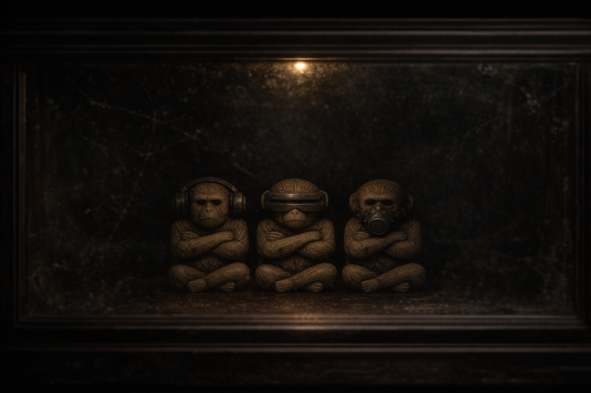

*Preprint / Working paper / Not peer reviewed.*

\clearpage

{#fig:MapClassicOfSongsYong width="100%"}

> This paper emerged from the convergence of several lines of inquiry: observations of war as a media-saturated and social environment in which regimes of communication, trust and interpretation are deformed; interest in reduced sign systems (including emoji as a partially iconic and mnemonically charged form of communication); as well as the analysis of manipulative practices in which sign and interpretation are used as instruments of influence.[^1]
>
> The theoretical horizon of this inquiry is shaped by early modern projects of a universal language and combinatorial thinking; a particularly important reference point is Leibniz’s 1666 *Dissertatio de arte combinatoria*, against the background of which the author’s own experiments were developed to build a minimal formalized symbolic form.
>
> This article offers a theoretical synthesis of that trajectory.

## Introduction: Why “Language” Rather Than “Message”

In the first article of the series, I focus not on isolated “scary words” but on a broader structural shift in the genre: in a number of key media cases of recent decades, the channel through which meaning is transmitted itself becomes dangerous [@mcluhan1964a; @wald2008a; @parikka2007a; @sampson2012a]. If the second article of the series described the Japanese material through the model “strike → body → mutation,” and the third through “environment → ruin → adaptation,” then the logic here is different: **“signal → perception → contagion → subjective disintegration”**.[^3] The analysis is limited to the corpus of works in which the channel of perception functions as a mechanism of harm.

This difference is fundamental. In the classic genre model, communication serves the plot (characters exchange information about an external threat). In the modern model, communication ceases to be a neutral mediator: speaking, listening, watching or receiving a signal means entering a zone of risk and possible harm [@wald2008a; @sperber1996a; @parikka2007a; @sampson2012a]. Therefore, the central research question is formulated as follows: **why does the act of perception turn into a source of harm in the latest media horror and science fiction?** [@wald2008a; @sperber1996a]

This level of analysis also resonates with the classic formula “don’t see, don’t hear, don’t speak.”[^6] In the traditional reading, it functions as a moral injunction, but in the logic of modern media horror and science fiction, the same structure is reinterpreted as a technical survival strategy: refusal to perceive becomes a way to avoid harm carried by the channel.

In the extreme, this means that the very fact of understanding can itself become a mechanism of harm.

The working thesis of this article is as follows: in a number of key media cases of modern horror and science fiction, both language and the media through which it circulates are pathologized, and speech, hearing, vision and technical signals turn into channels of contagion; in this logic, language functions simultaneously as a memetic, political and technological virus, with *Metal Gear Solid V: The Phantom Pain* serving as a central case for such transformation [@hall2018a; @hammar2019a].

\newpage

In order not to turn the word “virus” into a vague metaphor, the series includes a separate companion paper: *Viruses and Bioweapons: Infection Mechanics and Media Analogues* (Companion working paper, Canon Horror Series, 04, 2026), where biological mechanics, the legal framework of bioweapons, and media analogues of contagion are separated. This article uses the word “virus” as an extended model of contagiousness; in a strict biological sense, some of the cases relate to parasitic or hybrid agents, and this is specifically addressed in that companion paper.[^8] I also introduce the working term **“synthesization”** here: a hybrid configuration in which a constructed agent operates in a mass outbreak mode and combines epidemic dynamics with weapons logic.[^8]

## 1. Theoretical Framework: Media Epidemiology

### 1.1. McLuhan: Damage to the Medium as Damage to the Subject

The methodological point of departure is McLuhan's classic formula: media are “extensions of man” [@mcluhan1964a]. In the research literature, this is often reformulated as a thesis about prosthetic extensions of perception: the vulnerability of the channel automatically becomes human vulnerability. In other words, if a channel is compromised, it is not only the information moving through it that is compromised, but also the perception configuration itself.

This has a stark conclusion for horror: when the medium is damaged, the subject is damaged. Not “a monster attacks a person”, but “a communication infrastructure reconfigures the human subject as a carrier of threat” [@mcluhan1964a].

### 1.2. Memetics and the Limits of the Viral Metaphor

The second supporting block is memetics. The source corpus uses Dawkins' basic formula: the meme as a cultural replicator, that is, a unit that spreads through processes of reproduction and selection [@dawkins1976a]. In the well-known English formulation: “Examples of memes are tunes, ideas, catch-phrases, clothes fashions, ways of making pots or of building arches.” [@dawkins1976a]

This logic requires a critical caveat: without it, the analysis easily slides into the journalistic metaphor of “viral ideas” [@wald2008a; @sperber1996a]. Therefore, in this work, memetics is used not as a universal explanation of culture, but as an **operational model of contagious spread** within specific genre cases.

### 1.3. Sontag, Wald, Parikka, Sampson: How to Use the Metaphor of Contagion Methodologically

A critical methodological caveat: “contagion” is not a neutral word in cultural analysis. Sontag shows how disease as a metaphor can easily become moral and political stigma [@sontag1978a]. Wald describes a persistent “outbreak narrative”: discovery, dissemination, attempt at containment [@wald2008a; @sperber1996a]. Parikka and Sampson translate this narrative into digital and affective environments, where virality describes not only biology, but also the architecture of networks [@parikka2007a; @sampson2012a].

Therefore, in this article, “language as infection” is understood not in the biomedical literal sense, but as a media-cultural model: the channel sets off a cascade of replication, and the subject loses control over the mode of perception [@sontag1978a; @wald2008a; @sperber1996a; @parikka2007a; @sampson2012a].

“Virality” within this text is used as an analytical model, and not as a universal property of language. This model describes a specific mode of media horror, in which the very act of perception turns into a mechanism of selection, control, and harm: epistemology turns into biopolitics, and access to speech, image, signal or interface becomes a point of vulnerability and distribution of violence. In other regimes, the channel may collapse (epistemological crisis), remain neutral, or not play a significant role.

### 1.4. Alternative Frameworks and the Limits of the Model

The model under consideration identifies one stable reading mode, but does not exhaust the entire range of interpretations. Even within the current series, it is clear that horror does not operate only through channels of harm, but also through other carriers of danger.

In the second article of the series, the Japanese material captures the trajectory “strike → body → institutional bioregime,” and in the third article, the Ukrainian case unfolds the line “environment → infrastructure → everyday adaptation.” In both cases, the channel of communication is important, but is not always the primary engine of horror.

Therefore, this article deliberately highlights a limited set of cases where the channel of perception itself becomes a mechanism of harm, and it is in this mode that it forms a comparable analytical matrix.

### 1.5. “Channel-agent” and “channel-infrastructure”: operational separation

To remove the residual effect of universalization, the article introduces a working distinction:

- **Channel-agent** — the channel itself functions as the immediate vector of harm, acting as a direct trigger (for example, *MGSV*, *Pontypool*).
- **Channel-infrastructure** — the channel does not strike directly, but organizes a regime of unreliability and a crisis of trust (for example, *The Thing*).
- **Outside the channel model** — the source of horror does not depend on the mode of the channel as a central node (for example, *Hereditary*).

This tripartite distinction does not replace the entire genre typology, but serves as a filter of boundaries: it shows where this article applies directly, and where it requires a different analytical framework.

## 2. Typology of channels: speech, hearing, vision, signal

For analytical comparability, I use the following matrix: **channel → trigger → effect → countermeasure** [@wald2008a; @sperber1996a].

1. **Speech/language**: the trigger is built into the very fact of speaking; effect: breakdown of agency; countermeasure: silence or language shift [@konami2015a; @hall2018a; @hammar2019a].
2. **Hearing / conversation**: danger arises in ordinary communication; survival requires isolation, filtering, noise protection [@burgess1998a; @mcdonald2008a; @kirsch2018a; @ottmann2014a; @kum2016a; @hotskull2022a; @keflioglu2025a].
3. **Vision**: the act of visual contact becomes lethal; survival requires abandoning the “normal” visual mode [@malerman2014a; @bier2018a; @kremmel2018a].
4. **Technical signal**: the network and device act as a carrier of a pathogenic signal; the basic countermeasure is shutdown and off-grid behavior [@king2006a; @hoeglund2015a].

Thus, within the selected corpus, the center of this horror model is not the monster itself, but the governability of the channels through which reality is accessed.

A similar logic is also demonstrated by *Ringu* and the VHS strand of found-footage horror: in them, the threat is fixed in the mode of transmission, recording, and playback of experience, and not just in a bodily attack [@suzuki1991a; @nakata1998a; @vhs2012a]. A related, though less analytically clean, example is *Ghosts of War* [@weekes2020a]. This logic is particularly productive for further analysis of platform and automated modes of medial selection.

## 3. Central case: *Metal Gear Solid V* and the biopolitics of language

In the game corpus, it is MGSV that sets the most radical formulation of the problem: “voice parasites” turn language into a biological trigger, and the choice of language into a matter of life and death [@konami2015a; @hall2018a; @hammar2019a]. It is important here that we are talking not only about a fantastic infection, but also about the politics of power over communication.

Skull Face articulates this logic directly: “Words can kill.” [^18] This remark fits into a broader line of “weaponization of language”, where the lingua franca (English) figures as an infrastructure of global control [@konami2015a; @hall2018a; @hammar2019a].

In mission 43 (quarantine elimination of the infected at the base), the game demonstrates the transition from “individual horror” to administrative sanitary logic: control over language becomes a practice of sorting bodies [@konami2015a; @hall2018a; @hammar2019a]. At this point, MGSV connects three levels at once:

- **biological** (parasite and bodily trigger),
- **political** (population control through language),
- **medial** (communication channel as a weapon).

MGSV is therefore not merely a “story about a virus,” but a model of how the subject becomes vulnerable at the level of a basic communicative function.

## 4. Comparative Block: from an infected word to an infected interface

### 4.1. *Pontypool*: semantics as pathology

In *Pontypool*, contagion moves through language and conversation, and the medium of radio turns a local speech failure into a collective epidemic [@burgess1998a; @mcdonald2008a; @kirsch2018a; @ottmann2014a]. The key analytical value of the case: what becomes “ill” is not the body as such, but the relation between word and meaning: aphasia, repetition, and semantic collapse become part of the dramaturgy of infection [@kirsch2018a; @ottmann2014a].

### 4.2. *Hot Skull* (Sıcak Kafa): conversation as pathogenic everyday life

The Turkish case intensifies the everyday dimension of this logic: danger is built into everyday conversation, that is, into the most “normal” social practice [@kum2016a; @hotskull2022a; @keflioglu2025a]. Hence the biopolitical conclusion: control of communication becomes a form of population control, and refusal of communication becomes a practice of survival.

### 4.3. *Bird Box*: visual channel and inversion of the norm

In *Bird Box* vision itself becomes the fatal trigger; survival requires blindfolding, blindness, and trust in alternate navigation modes [@malerman2014a; @bier2018a; @kremmel2018a]. Within the framework of the general typology, this is a demonstration of the “deviation from the norm as protection” mechanism [@malerman2014a; @bier2018a; @kremmel2018a].

### 4.4. *Cell*: the technical network as a pathogen

In *Cell*, the threat is carried not by a word or an image as such, but by the infrastructural signal of the mobile network [@king2006a; @hoeglund2015a]. In this way, horror captures late modern fear: dependence on connectivity makes the subject vulnerable to a mass impulse that cannot be recognized in time.

### 4.5. *Snow Crash*: interface, code, and reprogramming

Finally, *Snow Crash* links the linguistic and computational levels: language functions as code, capable of reprogramming the subject through an interface [@stephenson1992a; @kelly2018a]. This is an important precursor to modern platform virality, where contagion is conceived as a property of the protocol.

### 4.6. *Resident Evil*: laboratory “synthesization” as a contrast to MGSV

Within the Capcom circuit (*Resident Evil*), the threat is built not on linguistic selection, but on the laboratory assembly of viral and parasitic platforms that enter biocatastrophe mode.[^8] This mini-case is needed as a structural contrast: if MGSV shows controlled harm mediated through a linguistic filter, then *Resident Evil* models an industrial-military accident, where the key mechanism is mass biological distribution.[^8]

### 4.7. Case-Type Labels (Article 04)

To preserve the linear logic of the article (“channel → harm”) and simultaneously take into account the origin of the agent within each case, a working triple is used:

- **Epidemic** - spread without a proven targeted weapons circuit.
- **Bioweapon** — the presence of intent, a controlled circuit of use, and the logic of selective destruction.
- **Synthesization** — a hybrid configuration where a laboratory/designed agent operates in mass outbreak mode.

In the current corpus it looks like this: *Pontypool*, *Hot Skull*, *Bird Box* and *Cell* are the epidemic type (biological or non-biological), MGSV is the bioweapon type, and *Snow Crash* and the Capcom circuit (*Resident Evil*) are the “synthesization” type.[^8]

This restores the question of responsibility (“who launched the circuit, and how”), but does not destroy the main conclusion of the article: regardless of the origin of the agent, in the corpus under consideration the mode of operation of the perception channel is decisive. For contrast, it is convenient to compare MGSV (a language-selective parasitic tool) and the Capcom scenario of synthetic viruses (a laboratory biocatastrophe).[^8]

## 5. Psychopolitics of “dangerous perception”

A comparison of these cases allows us to describe a stable anthropology of fear.

First, there is the fear of losing the basic functions of the subject: voice, language, hearing, conversation, and vision [@konami2015a; @hall2018a; @hammar2019a; @burgess1998a; @mcdonald2008a; @kirsch2018a; @ottmann2014a; @malerman2014a; @bier2018a; @kremmel2018a], the ability to distinguish between signal and noise [@king2006a; @hoeglund2015a].

Second, there is the fear of dependence on the media environment: the deeper the perception is mediated by interfaces and networks, the higher the risk of a pathogenic point of entry through everyday channels [@parikka2007a; @sampson2012a].

Third, there is the fear of normativity. In all key cases, it is not the one who “adapts better to the norm” who survives, but the one who refuses it: remains silent and redefines language [@konami2015a; @hall2018a; @hammar2019a], filters speech and breaks normal conversational mode [@burgess1998a; @mcdonald2008a; @kirsch2018a; @ottmann2014a], rejects the visual norm [@malerman2014a; @bier2018a; @kremmel2018a], goes offline [@king2006a; @hoeglund2015a].

It is here that the first article of the cycle directly connects with two already prepared ones: the Japanese model showed the transition from an external monster to an infected body, [^20] the Ukrainian model showed the transition to an infected environment, [^21] and the language model carries this logic to the level of the channel of perception itself.

## Conclusion: From the Monster to the System, and Then to the Channel (Within a Limited Corpus)

If we collect the three articles into a single line, the general evolution of threat localization becomes visible:

1. in the external being;
2. in the internal mutation of the body;
3. in an infected spatial environment;
4. in the transmission channel itself.

In this sense, “language as infection” is not a particular topic about “word viruses”, but the most abstract level of the series within the selected corpus: a steady tendency to shift horror to the channels of perception is recorded here.

In this model, the subject is vulnerable not because it is weak, but because perception itself makes it vulnerable.

---

[^1]: By “experimental protocols,” I mean attempts to formalize the transmission of meaning through minimal and partially iconic sign systems (at the limit, the reduction of language to a limited set of visual symbols and rules for their combination). Methodologically, this is based on two lines: (1) early modern projects of a universal language and *ars combinatoria* (primarily Leibniz, *Dissertatio de arte combinatoria*, 1666; see also studies on the history of universal language and the art of memory), (2) modern studies of emoji as a conventionalized sign system with mnemonic and operational functions in digital communication (in particular, Kempe & Raviv, 2025).

[^3]: The three-part logic of the series (body/environment/language) is used in this article as the author’s analytical scheme; in the output section it is correlated with the already prepared articles of the cycle.

[^6]: The formula “see no evil, hear no evil, speak no evil” (often visualized through the three monkeys) originates from the East Asian ethical tradition and is usually interpreted as a precept to avoid evil at the level of perception and speech. From an analytical perspective, it can be read as a scheme for limiting sensory channels: vision, hearing and speech act as controlled interfaces with reality. In media horror, this structure is inverted: limiting channels ceases to be a moral act and becomes a practice of survival.

[^8]: Companion working paper (Canon Horror Series, 04, 2026): *Viruses and Bioweapons: Infection Mechanics and Media Analogues*.

[^18]: The Skull Face quote (“Words can kill.”) is recorded in game cutscenes and transcripts of *Metal Gear Solid V: The Phantom Pain* (2015).

[^20]: Companion working paper (Canon Horror Series, 02, 2026): *After the Nuclear Strike: The Transformation of Japanese Horror from Monster to Infected System*.
[^21]: Companion working paper (Canon Horror Series, 03, 2026): *When Disaster Becomes Environment: Chernobyl and the Spatial Model of Horror*.

\newpage

## Bibliography
<!-- ZG_BIBLIOGRAPHY_SECTIONS -->
